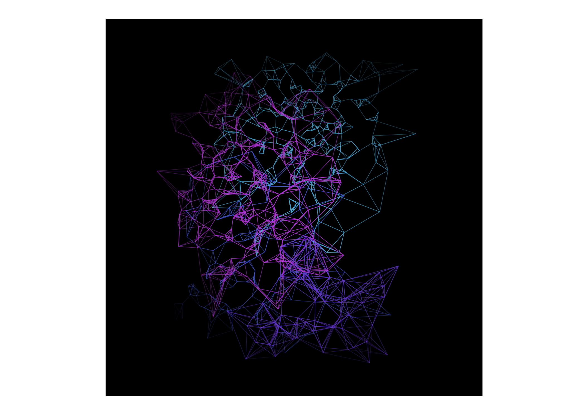

<!-- README.md is generated from README.Rmd. Please edit that file -->

# StochasticArt

<!-- badges: start -->
<!-- badges: end -->

The goal of StochasticArt is, naturally, to generate stochastic art!
This package is really just a fun personal project, but perhaps it will
find its way to some curious explorers who have not thought about ways
in which R can be used to create visually interesting things.

## Installation

You can install the development version of StochasticArt from
[GitHub](https://github.com/) with:

``` r
# install.packages("devtools")
devtools::install_github("christopher-rowe/StochasticArt")
```

## Examples

First, load the package.

``` r
library(StochasticArt)
```

Now try out some of the functions! If you don’t specify a value to the
`seed` argument, a random `seed` will be generated and printed to the
console so that you can always regenerate a previous image.

Not specifying any arguments will always generate a random image, but I
encourage you to mess around with some of the arguments to see how the
output changes. And even better, check out the code underlying each of
the functions!

``` r
generate_fabric(seed=53266553)
#> Seed: 53266553
```


``` r
generate_lines_and_polygons(seed=83205155)
#> Seed: 83205155
```



``` r
generate_perception_matrix(seed=58283814)
#> Seed: 58283814
```


``` r
generate_lines_and_rectangles(seed=60828695)
#> Seed: 60828695
```


``` r
generate_panels(seed=8694671)
#> Seed: 8694671
```


``` r
generate_circles(seed=50942804)
#> Seed: 50942804
```


``` r
generate_string_waves(frame='points', seed=69097986)
#> Seed: 69097986
```


