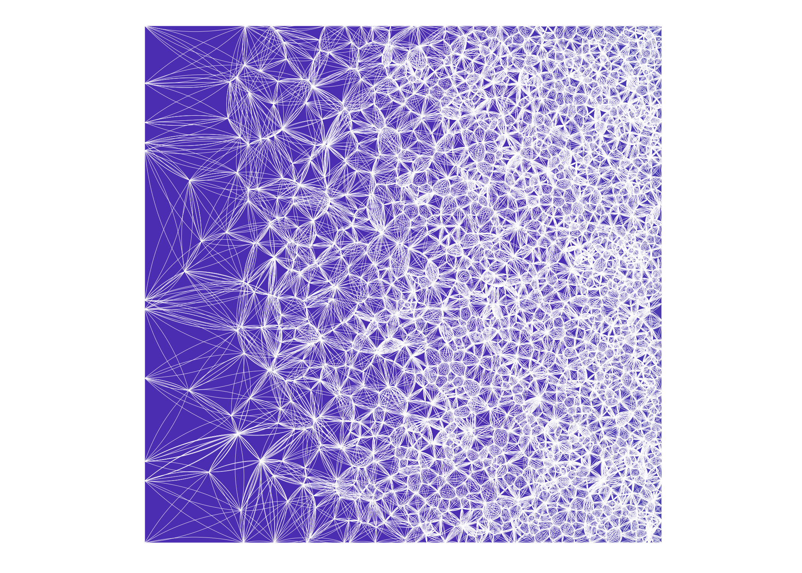
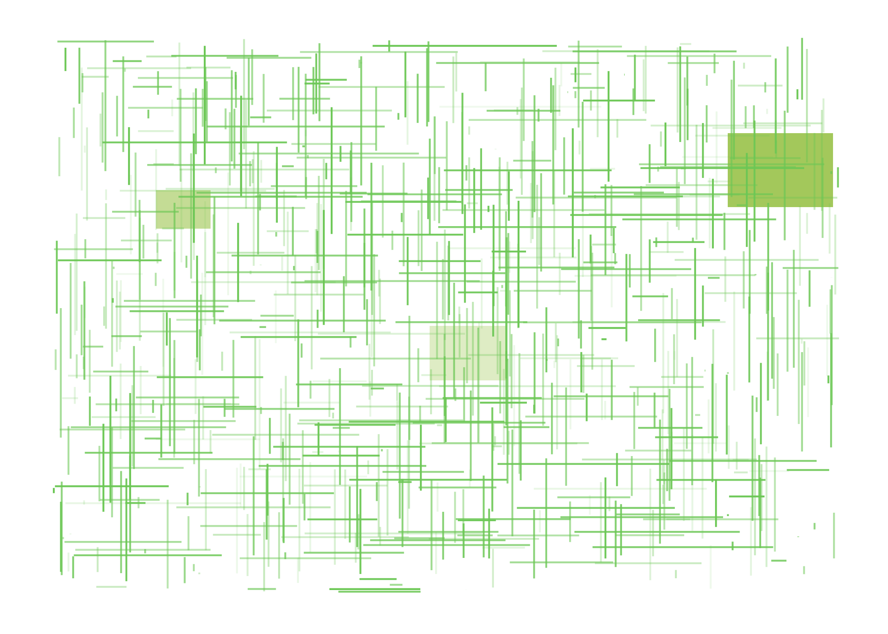

<!-- README.md is generated from README.Rmd. Please edit that file -->

# StochasticArt

<!-- badges: start -->
<!-- badges: end -->

The goal of StochasticArt is, naturally, to generate stochastic art!
This package is really just a fun personal project, but perhaps it will
find its way to some curious explorers who have not thought about ways
in which R can be used to create visually interesting things.

## Installation

You can install the development version of StochasticArt from
[GitHub](https://github.com/) with:

``` r
# install.packages("devtools")
devtools::install_github("christopher-rowe/StochasticArt")
```

## Examples

First, load the package.

``` r
library(StochasticArt)
```

Now try out some of the functions! If you don’t specify a value to the
`seed` argument, a random `seed` will be generated and printed to the
console so that you can always regenerate a previous image.

Not specifying any arguments will always generate a random image, but I
encourage you to mess around with some of the arguments to see how the
output changes. And even better, check out the code underlying each of
the functions!

``` r
generate_fabric()
#> Seed: 87267225
```



``` r
generate_lines_and_polygons()
#> Seed: 19731403
```


``` r
generate_perception_matrix()
#> Seed: 97029509
```


``` r
generate_lines_and_rectangles()
#> Seed: 37873959
#> Warning: data frame results in `filter()` are deprecated, use `if_any()` or
#> `if_all()`.

#> Warning: data frame results in `filter()` are deprecated, use `if_any()` or
#> `if_all()`.
```



``` r
generate_panels()
#> Seed: 79461970
```


``` r
generate_circles()
#> Seed: 46160109
```


``` r
generate_string_waves()
#> Seed: 98858422
```


